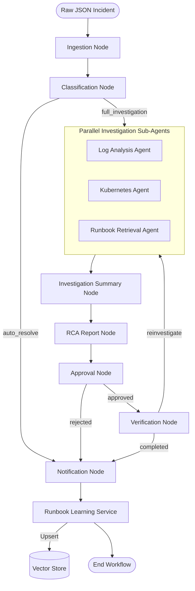
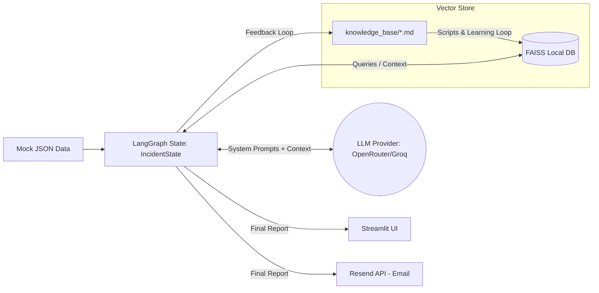

# Application KT Document: AI Incident Triage

## 1. Application Overview

**What is this application?**
The AI Incident Triage application is a proof-of-concept (POC) built in Python using LangGraph and LangChain. It orchestrates a multi-agent AI pipeline to automate the first pass of incident triage.

**What problem does it solve?**
During an incident, Site Reliability Engineers (SREs) and on-call developers spend valuable initial minutes doing repetitive work: reading the alert, estimating severity, finding the correct runbook, and correlating logs. This application automates that initial investigation so the engineer is handed a clear, cited, and appropriately-hedged starting point. 

**What is the business/technical purpose?**
To reduce Mean Time to Resolution (MTTR) by eliminating manual toil in the early stages of incident response. It is explicitly designed **not** to execute auto-remediation, but rather to serve as an intelligent assistant that compiles structured triage reports.

**Who/what uses it?**
SREs, DevOps engineers, and on-call developers. The current implementation supports manual ingestion via a CLI or a local Streamlit web UI.

**High-level functionality and major use cases:**
1. Ingests raw incident payloads (currently via mock JSON files).
2. Classifies the incident type and determines severity (combining deterministic rules with an LLM).
3. Investigates the incident in parallel using specialized sub-agents:
   - Log Analysis Agent
   - Kubernetes Agent
   - Runbook Retrieval Agent (via Retrieval-Augmented Generation / RAG)
4. Synthesizes findings into a Root Cause Analysis (RCA) report.
5. Routes for optional human approval and verification.
6. Sends notification emails to stakeholders.

---

## 2. Architecture

**Overall Architecture:**
The application uses a stateful, directed acyclic graph (DAG) model powered by **LangGraph**. The workflow consists of single-purpose nodes (Python functions) that accept a shared `IncidentState` dictionary, perform their specific task (often invoking an LLM), and return a state update.

**Request / Data Flow:**
When an incident is triggered, the LangGraph Supervisor orchestrates the workflow. 
1. The **Classification** node runs first.
2. If full investigation is required, it branches to the **Investigation** node.
3. The Investigation node executes multiple sub-agents concurrently.
4. The results are aggregated in the **Investigation Summary** node.
5. The **RCA Report** node generates the final output.
6. Depending on configuration, it goes through **Approval** and **Verification**.
7. Finally, the **Notification** node emails the result.



---

## 3. Technology Stack

| Category | Technology | Why it is used |
| :--- | :--- | :--- |
| **Frontend** | Streamlit | Provides a quick, interactive local web UI without writing separate frontend code (HTML/React). |
| **Backend / Orchestration** | Python 3.13, LangGraph, LangChain | Python is the standard for AI/ML. LangGraph handles complex stateful agent workflows, cyclic graphs, and retries. |
| **LLM Providers** | OpenRouter, Groq | Exposes a unified API for interacting with open-source/hosted models (e.g., DeepSeek, Llama3) without vendor lock-in. |
| **Vector Store / DB** | FAISS, ChromaDB (Local) | Stores and queries document embeddings (runbooks) locally for fast RAG without requiring cloud database infrastructure. |
| **Embeddings** | `sentence-transformers` | Runs a lightweight embeddings model (`all-MiniLM-L6-v2`) entirely locally on CPU, ensuring privacy and saving costs. |
| **Notifications** | Resend | Simple, developer-friendly API for sending transactional emails (incident reports). |
| **Observability** | LangSmith | Natively integrates with LangChain/LangGraph to provide deep observability into LLM traces, latency, and token usage. |
| **Dependency Management** | `uv` | A fast, modern Python package installer and resolver replacing pip/poetry. |
| **Infrastructure / IaC** | Not found in repository | This is a local POC; no cloud infrastructure is provisioned. |

---

## 4. Repository Structure

```text
ai-incident-triage/
├── app/                        # Main application source code
│   ├── agents/                 # LLM Agent implementations (classification, investigation, rca, etc.)
│   ├── domain/                 # Pydantic models, schemas, and enums (the application's data structures)
│   ├── graph/                  # LangGraph definitions: workflow, nodes, router, and state (IncidentState)
│   ├── knowledge/              # RAG implementation (vector store, embeddings, chunking)
│   ├── tools/                  # Mock tools (logs, kubernetes, on-call adapters) and Resend adapter
│   ├── ui/                     # Streamlit web interface (`streamlit_app.py`)
│   ├── config.py               # Pydantic-settings based environment configuration
│   └── main.py                 # Typer CLI entrypoint
├── data/incidents/             # Mock incident JSON payloads for testing
├── docs/                       # Auto-generated architecture/graph diagrams
├── knowledge_base/             # Markdown runbooks, postmortems, and SOPs ingested by the RAG system
├── scripts/                    # Utility scripts (e.g., ingest_knowledge.py to build the local vector store)
├── tests/                      # Pytest unit and integration tests
├── .env.example                # Template for required environment variables
├── pyproject.toml / uv.lock    # Python dependency management configuration
└── README.md                   # Application entrypoint instructions
```

**Where developers should make changes:**
* **To alter workflow logic:** Modify `app/graph/workflow.py` and `app/graph/nodes/`.
* **To update prompts/agent behavior:** Modify files within `app/agents/<agent_name>/`.
* **To add domain knowledge:** Add Markdown files to `knowledge_base/runbooks/` and run the ingestion script.

---

## 5. Application Components

### 1. LangGraph Orchestrator (`app/graph/workflow.py`)
* **What it does:** Assembles the nodes and conditional edges into a compiled graph.
* **Why it exists:** Provides a deterministic, observable execution path for the various agents.

### 2. Classification Agent (`app/agents/classification/agent.py`)
* **What it does:** Uses a combination of deterministic rules (to establish a minimum severity floor) and an LLM to categorize the incident and determine its Priority (P1-P4).
* **Dependencies:** Relies on `create_structured_agent` from `app.llm.client` to enforce JSON output.

### 3. Investigation Sub-Agents (`app/agents/investigation/`)
* **Log Analysis Agent:** Parses mock logs to detect errors (e.g., HTTP 500s, stack traces).
* **Kubernetes Agent:** Evaluates mock telemetry (pod states like `CrashLoopBackOff`, memory usage vs limits).
* **Runbook Agent:** Uses FAISS vector search to find the most semantically relevant runbook from the `knowledge_base` based on the incident description.

### 4. RCA Report Agent (`app/agents/rca_report/agent.py`)
* **What it does:** Synthesizes the parallel findings and hypotheses generated by the investigation sub-agents into a final Markdown Root Cause Analysis report.

### 5. Notification Agent (`app/agents/notification/agent.py`)
* **What it does:** Formats the final incident report and emails it to the on-call engineer using the Resend API adapter.

---

## 6. End-to-End Request Flow

1. **Trigger:** A user runs the CLI (`uv run python -m app.main <json_file>`) or clicks "Run Triage" in the Streamlit UI.
2. **Ingestion Node:** The raw JSON is normalized into the `Incident` Pydantic model.
3. **Classification Node:** Deterministic rules run (e.g., if env is PROD and service is AUTH, floor is P1). LLM confirms the priority and outputs a `ClassificationResult`.
4. **Investigation Node:** The Orchestrator fires the `LogAnalysisAgent`, `KubernetesAgent`, and `RunbookAgent` **in parallel**.
   - Agents query their respective mock tools or the local FAISS vector store.
5. **Investigation Summary Node:** Gathers all returned `Evidence` and `Hypothesis` objects.
6. **RCA Node:** The LLM receives all evidence and drafts a comprehensive `RootCauseAnalysis`.
7. **Approval Node:** (If configured) Auto-approves or waits for human sign-off.
8. **Notification Node:** Dispatches an email payload to the Resend API.
9. **Runbook Learning Service (Side-effect):** If the incident is successfully resolved, this service updates or creates a new runbook in the `knowledge_base` and re-ingests it into the vector store.
10. **End:** The final `IncidentState` is returned to the UI/CLI for rendering.

---

## 7. Data Flow



* **Where data is stored:** No persistent relational database exists. State is transient in-memory during execution. Long-term embeddings are stored in a local folder (`vectorstore/`).

---

## 8. Configuration and Environment Management

**Environment Types:**
Only a local development/testing environment is supported.

**Configuration Management:**
Configuration is managed via Pydantic Settings (`app/config.py`), reading from `.env`.

**Important Environment Variables (stored in `.env`):**
* `LLM_PROVIDER`: Defines the active provider (`openrouter` or `groq`).
* `OPENROUTER_API_KEY`, `GROQ_API_KEY`: API keys for the chosen LLM provider.
* `RESEND_API_KEY`: Key for email functionality.
* `LANGCHAIN_TRACING_V2`, `LANGCHAIN_API_KEY`: Enables LangSmith tracing.

**How configuration is injected:**
Agents and services import `get_settings()` from `app.config`.

---

## 9. Infrastructure
*Not found in repository.*
The application runs entirely locally on the developer's machine as a Proof of Concept.

## 10. Infrastructure as Code
*Not found in repository.*
No Terraform, CloudFormation, or CDK templates exist.

## 11. CI/CD Pipeline
*Not found in repository.*
No GitHub Actions, GitLab CI, or Jenkins pipelines exist.

## 12. Deployment Process
There is no cloud deployment process. 

**Local Deployment:**
1. **Prerequisites:** Install `uv` package manager.
2. **Clone & Install:**
   ```bash
   uv sync
   ```
3. **Environment:** Copy `.env.example` to `.env` and populate `OPENROUTER_API_KEY` (or Groq).
4. **Seed Knowledge Base:**
   ```bash
   uv run python scripts/ingest_knowledge.py
   ```
5. **Start UI:**
   ```bash
   uv run streamlit run app/ui/streamlit_app.py
   ```

---

## 13. Local Development Setup

A new developer can start the application using the exact steps listed in **Section 12**.

* **Tools required:** Python 3.13, `uv`.
* **Testing CLI directly:**
  ```bash
  uv run python -m app.main data/incidents/database_timeout.json --use-llm
  ```
* **Linting / Formatting:** Provided by `ruff` and `mypy` (configured in `pyproject.toml`).

---

## 14. Testing

* **Framework:** Pytest.
* **Test Location:** `/tests/`
* **Test Types:** Unit tests covering CLI interfaces, guardrail factories, classification rules, and LLM client logic.
* **How to run:**
  ```bash
  uv run pytest
  ```

---

## 15. Observability

* **Application Logs:** Output to standard `stdout`/`stderr` using the native Python `logging` module. Visible directly in the terminal where Streamlit or the CLI is running.
* **Tracing (LLM Observability):** Integrates tightly with **LangSmith**.
  * By setting `LANGCHAIN_TRACING_V2=true` and providing a `LANGCHAIN_API_KEY` in `.env`, every execution node, prompt, LLM response, latency, and token count is logged to the LangSmith dashboard.
  * **Where to look when something fails:** Look at the Streamlit console logs first, then open the LangSmith dashboard to inspect exact LLM request payloads and JSON schema validation errors.

---

## 16. Security

* **Secrets Management:** Kept locally in the `.env` file. *Never commit this file.*
* **Network / Firewalls / IAM:** Not applicable (local POC).
* **Container Security:** Not applicable (no Dockerfiles).
* **Important Considerations:** 
  * The Streamlit UI has **no authentication** layer (explicitly noted in the source code). It must not be exposed to the public internet without an auth proxy (like OAuth2 Proxy or an ALB with OIDC).

---

## 17. Troubleshooting / Common Issues

| Symptom | Possible Cause | How to Fix | Useful Commands |
| :--- | :--- | :--- | :--- |
| **CLI / UI throws `LLMConfigurationError`** | Missing API key in `.env` | Ensure `.env` is created and `OPENROUTER_API_KEY` (or configured provider) is set. | `cat .env` |
| **Runbook Agent returns `VectorStoreCollectionMissing`** | FAISS database was not built | The vector store is missing. Run the ingestion script. | `uv run python scripts/ingest_knowledge.py` |
| **Email fails to send silently** | `RESEND_API_KEY` is missing | The Resend adapter ignores failures if keys are missing (or returns a failure result instead of throwing). Ensure key is set and domains are verified in Resend. | N/A |
| **Streamlit UI fails to start** | Python dependencies missing | Virtual environment is out of sync. | `uv sync` |

---

## 18. Rollback and Recovery
*Not found in repository.* (Local application).

---

## 19. Operational Runbook

* **Updating Runbooks manually:** 
  1. Add/modify markdown files in `knowledge_base/runbooks/`.
  2. Run `uv run python scripts/ingest_knowledge.py --file <path> --collection runbooks` to regenerate the local FAISS vector store embeddings.
* **Auto-generated Runbooks (Runbook Learning Loop):**
  * When an incident is successfully verified as resolved, the system will automatically append a new `## Observed Incident` section to a similar runbook (if threshold >= 0.80) or create a new runbook.
  * *Audit Note:* SREs should periodically review the auto-generated files in `knowledge_base/runbooks/` for quality and manually refine or delete them if the LLM hallucinated steps.
* **Switching LLM Models:**
  1. Open `.env`.
  2. Change `LLM_PROVIDER=groq` (for example).
  3. Ensure `GROQ_API_KEY` and `GROQ_MODEL` are set.
  4. Restart the Streamlit UI.

---

## 20. Important Dependencies

* **OpenRouter / Groq APIs:** Critical external dependencies. If unreachable, the LLM agents will fail. The graph handles errors, but the application will not produce RCA reports without an LLM.
* **Resend API:** Required for the Notification node to successfully dispatch emails.
* **LangGraph/LangChain:** The foundational orchestration framework.

---

## 21. Known Risks / Technical Debt

*(Observations based strictly on repository evidence)*
* **Manual Data Mocking:** `app/tools/mock/*` hardcodes logic (e.g. `mock_k8s_tool.py`, `mock_logs.py`). To move to production, these must be replaced with real Datadog/Kubernetes API integrations.
* **No Infrastructure or CI/CD:** The repository completely lacks Dockerfiles, Kubernetes manifests, Terraform, or pipeline configurations, meaning it is not currently deployable to cloud environments.
* **Unauthenticated UI:** The Streamlit app lacks login/SSO capabilities.
* **Local Ephemeral Vector Store:** The Chroma/FAISS database is built locally. In a distributed cloud environment, this needs to be moved to a hosted vector database (like Pinecone or AWS OpenSearch).
* **Runbook Learning Degradation:** Auto-generated runbook content could degrade retrieval quality over time if RCAs are wrong or incidents are misclassified, since there's no human review gate in the loop. A periodic manual audit of auto-appended sections is recommended.

---

## 22. FAQ

* **Where does the application run?** Locally on a developer's machine using `uv` and Python.
* **How do I deploy it?** Currently, it can only be run locally. There are no cloud deployment manifests provided.
* **Where are logs?** Output directly to the terminal stdout. Trace logs are sent to LangSmith (if configured).
* **Where are secrets?** In the local `.env` file.
* **How do I add a new incident type for testing?** Create a new JSON file matching the schema of existing files in the `data/incidents/` directory.

---

## 23. Quick Reference

* **Install Dependencies:** `uv sync`
* **Run Tests:** `uv run pytest`
* **Run UI:** `uv run streamlit run app/ui/streamlit_app.py`
* **Ingest Knowledge Base:** `uv run python scripts/ingest_knowledge.py`
* **Run CLI:** `uv run python -m app.main data/incidents/crashloopbackoff.json --use-llm`

---

## 24. KT Summary

The **AI Incident Triage** application is an intelligent proof-of-concept pipeline designed to automate the initial investigation of technical incidents. By orchestrating specialized LLM agents via **LangGraph**, it analyzes mock logs, fetches relevant runbooks using a local FAISS vector store, evaluates mock Kubernetes telemetry, and synthesizes the findings into a Root Cause Analysis report. 

It currently runs exclusively in local development environments via a Streamlit UI or CLI. The most important thing an engineer should know is that the pipeline logic lives in `app/graph/workflow.py`, LLM integrations rely heavily on the `.env` configuration, and any changes to documentation require re-running the knowledge ingestion script.

---

### Repository Evidence / References
* `README.md` (Execution instructions)
* `incident-triage-HLD.md` (Architecture and LangGraph justification)
* `pyproject.toml` (Technology stack and dependencies)
* `app/ui/streamlit_app.py` (Frontend logic and security warnings)
* `app/graph/workflow.py` (LangGraph flow and state transitions)
* `app/graph/state.py` (IncidentState definitions)
* `app/main.py` (CLI entrypoint)
