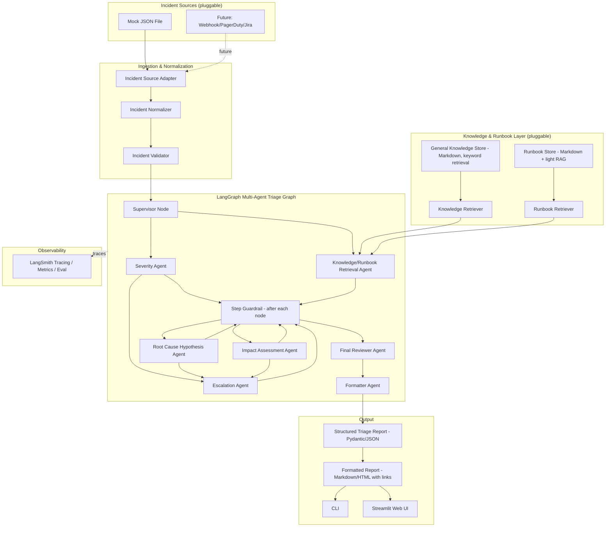
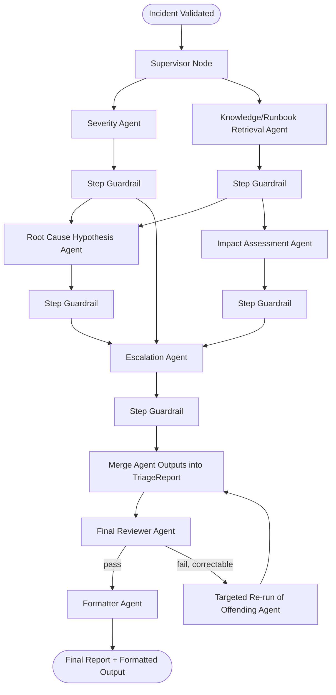
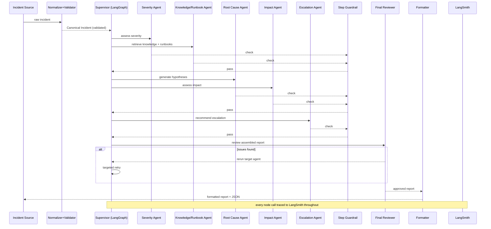

# Incident Triage AI — POC Architecture & Design Document

## 1. Executive Summary

This document defines the architecture for a POC that takes an incoming incident (initially a JSON file) and produces a structured, explainable triage report — automatically, the moment the incident arrives, with no human approval gate — grounded in organizational knowledge and runbooks.

---

## 2. Problem Definition

*(Unchanged from v1.)* Engineers responding to incidents spend their first several minutes doing repetitive, low-judgment work: reading the alert, guessing severity, finding the right runbook, deciding what to check first. The system's job is to do that first pass automatically and hand the engineer a clear, cited, appropriately-hedged starting point — not to decide anything on its own, and not to execute any remediation.

---

## 3. Goals and Non-Goals

**Goals (Phase 1):**
- Fully automatic pipeline: incident in → structured triage report out, no human approval required to generate it.
- Multi-agent decomposition via LangGraph, each agent handling one narrow task.
- Full observability of every agent step via LangSmith (trace, latency, tokens, pass/fail on guardrail checks).
- Step-level guardrail checks and a separate final-report review before output.
- Runbooks modeled and retrieved distinctly from general knowledge, with freshness awareness.
- Free/local-friendly LLM by default, swappable to any hosted provider via LangChain's model abstraction.

**Non-Goals (Phase 1):**
- Any action execution or auto-remediation.
- Real-time ingestion from live monitoring tools (still mock JSON).
- Full production-grade vector search across the entire knowledge base (narrow RAG for runbooks only — see §9).
- Human approval gating on report generation (explicitly rejected per this revision).
- Fine-tuning / training loops (collect feedback data, train nothing yet).

---

## 4. Key Architectural Principles

1. **Replaceability at the edges** — incident source, knowledge/runbook store, and LLM provider all stay behind narrow interfaces (unchanged principle from v1, now also applied to *which agents* run, via LangGraph's graph definition being config/code, not hardwired sequence).
2. **Small agents, narrow contracts.** Each agent does one job, takes a typed input, returns a typed output. No agent is a general-purpose "figure it out" black box.
3. **Two layers of review, not one.** A step-level guardrail checks each agent's output *as it's produced* (fast, cheap, narrow checks). A final reviewer checks the *assembled* report for cross-agent consistency (e.g. severity agent and escalation agent didn't contradict each other) — a broader, slower pass that only runs once.
4. **Full automation, full traceability.** No approval step blocks initial output, but every step is logged and traced (LangSmith) precisely because nothing is manually checked before it ships.
5. **Deterministic where possible, agentic where necessary.** Severity floors and citation-existence checks remain plain code, not agent calls — don't spend a model call on something a rule can do reliably and instantly.
6. **Untrusted text is always data, never instruction** — this applies to every agent's prompt, not just one central prompt as in v1.

---

## 5. Why Multi-Agent, and Why LangGraph (Addressing the "Is This Over-Engineering?" Question)

This is worth answering directly rather than just complying, since v1 explicitly argued against agentic architecture. What changed is the requirement, not my read of the underlying trade-off — with the requirement now explicit, here's the honest case for and the risk to watch:

**Why it's justified here:**
- The task already has natural seams — severity, knowledge/runbook lookup, root-cause hypothesis, impact, escalation — that benefit from being separate calls with separate, narrower prompts rather than one mega-prompt asking for ten things at once. Smaller prompts are easier to validate, cheaper to retry individually, and easier to swap models for (e.g. a cheap fast model for severity, a stronger model for root-cause reasoning).
- LangGraph's state-graph model gives per-node tracing, conditional routing (e.g. skip escalation-detail generation if severity is P4), and partial retries (retry just the failed node, not the whole pipeline) — real engineering value, not just structure for its own sake.
- LangSmith integration is native to LangChain/LangGraph, so the observability requirement and the multi-agent requirement reinforce each other rather than being two separate integrations.

**The risk to actively manage:** multi-agent pipelines can silently become slower and more expensive (more model calls) without a proportional quality gain, and failures become harder to reason about if agents aren't kept narrow. The mitigation is architectural, not aspirational: keep every agent's contract typed and single-purpose (§6), keep the graph shallow (one supervisor, five-ish worker nodes, not a deep tree), and let the step guardrail (§14) catch a misbehaving agent immediately rather than letting it cascade.

**What this is not:** this is not a "swarm" of autonomous agents making independent decisions or calling arbitrary tools. It's a fixed, small, well-typed graph — closer to "a pipeline with named, independently-retryable stages" than to open-ended multi-agent autonomy. That distinction is what keeps this from becoming the over-engineering v1 warned about.

---

## 6. Proposed High-Level Architecture (v2)



Every node in `Graph` emits a trace event to LangSmith; `GR1` (the step guardrail) is drawn once but conceptually runs after each agent node, not just once.

---

## 7. Detailed Component Architecture (v2)

| Component | Responsibility | Phase 1? |
|---|---|---|
| Incident Source Adapter / Normalizer / Validator | Unchanged from v1 — raw source → canonical `Incident` | Yes |
| Canonical Incident Model | Pydantic model, unchanged in spirit | Yes |
| Deterministic Severity Rules | Plain-code rule floor, runs outside the agent graph | Yes |
| General Knowledge Store + Retriever | Markdown + front-matter, keyword/metadata retrieval (unchanged — no RAG here) | Yes |
| **Runbook Store + Runbook Retriever** | Markdown runbooks with versioning metadata; retrieval is keyword-first with an optional light vector layer (§9) | Yes |
| **LangGraph Supervisor Node** | Owns the graph definition and routing logic (e.g. skip deep root-cause reasoning for P4s); the *only* place that knows the full flow | Yes |
| **Severity Agent** | Produces LLM-assessed severity + reasoning, reconciled with the deterministic floor | Yes |
| **Knowledge/Runbook Retrieval Agent** | Wraps the retrievers, decides what's relevant enough to pass downstream, flags knowledge gaps | Yes |
| **Root Cause Hypothesis Agent** | Generates hypotheses, strictly labeled, using retrieved context | Yes |
| **Impact Assessment Agent** | Customer/system impact, affected services/environments | Yes |
| **Escalation Agent** | Escalation recommendation + target team, informed by severity + impact outputs | Yes |
| **Step Guardrail** | Runs after every agent node; schema validation, citation-existence check, basic content-safety check | Yes |
| **Final Reviewer Agent** | Reviews the *assembled* report for cross-agent contradictions, unsupported claims that slipped past step guardrails, overall coherence | Yes |
| **Formatter Agent / step** | Produces the polished Markdown/HTML report with links, plus the canonical JSON | Yes |
| CLI / Streamlit UI | Unchanged from v1, now rendering the formatter's output | Yes |
| **LangSmith integration** | Tracing, latency/token metrics, run tagging by incident_id, golden-set evaluation runs | Yes |
| Audit Logger | Now largely subsumed by LangSmith traces; keep a lightweight local JSON log as a fallback/offline record | Yes |
| Configuration Manager | Now also selects: LLM provider per agent (optionally different models per agent), guardrail strictness, LangSmith project name | Yes |
| Full-corpus RAG (general knowledge) | Still postponed — see §9 | No |
| Human approval workflow | Explicitly rejected for Phase 1 per this revision | No |
| NeMo Guardrails (full framework) | Postponed in favor of lightweight custom guardrail + optional Llama Guard call — see §14 | No (Phase 2 candidate) |

---

## 8. Runbook Management (New)

Runbooks are split out from general knowledge because they have different lifecycle properties: they change more often, they're the thing an engineer actually acts on, and staleness in a runbook is actively dangerous (an out-of-date runbook can send someone to check the wrong dashboard).

```text
knowledge/
├── services/                    # general knowledge, unchanged
├── incidents/                   # unchanged
├── severity/                    # unchanged
├── general/                     # unchanged
│
└── runbooks/
    ├── payment-api-latency.md
    ├── database-outage.md
    └── kubernetes-pod-crash.md
```

Each runbook's front-matter now carries more structure than a general knowledge doc:

```yaml
---
title: Payment API Latency Runbook
service: payment-api
severity_applicable: [P1, P2]
tags: [latency, timeout, payment]
version: 3
last_reviewed: 2026-06-15
reviewed_by: sre-payments-team
owning_team: payments-oncall
external_links:
  - label: "Payment API latency dashboard"
    url: "https://grafana.internal/d/payment-latency"
  - label: "Database connection pool dashboard"
    url: "https://grafana.internal/d/db-pool"
---
```

**Why this matters architecturally:**
- `version` + `last_reviewed` let the Runbook Retrieval Agent flag a runbook as **potentially stale** in the report (e.g. "this runbook hasn't been reviewed in 9 months — verify its steps are current") rather than presenting it with the same confidence as a freshly-reviewed one.
- `external_links` are what the Formatter Agent turns into actual clickable links in the final report — this is the direct answer to "the report should include required documentation, links, and reports," not something bolted on afterward.
- Runbooks are versioned in git, same as code; the retriever can (optionally) record the git commit hash of the runbook at retrieval time, so a report is always traceable to the exact runbook version it used, even if the runbook is edited five minutes later.

---

## 9. RAG Reconsidered — Now Scoped Specifically to Runbooks

Direct answer to the question asked: **general knowledge base — still no RAG, that recommendation from v1 stands.** For a few dozen service/incident-pattern docs, keyword/metadata retrieval remains simpler, cheaper, and more debuggable, and nothing about adding agents changes that math.

**Runbooks are different, and here's my honest recommendation: yes, add a light vector layer for runbooks, now, not later.** Reasoning:

- Runbooks are the artifact most likely to be phrased differently than the incident that triggers them — an incident description says "payment API timing out," a runbook is titled "Elevated P99 Latency — Payment Service." Keyword matching alone will miss this more often than it will for general knowledge docs, which tend to be titled after the thing they describe.
- Runbooks change frequently (per your own framing), which means their *content* drifts even when their *filename/tags* don't get updated — semantic search over the live runbook text is more robust to that drift than keyword matching over stale tags.
- The blast radius of a missed runbook is higher than a missed general knowledge doc — it's the thing that tells someone what to actually check.

**Recommended scope — narrow, not a general RAG rebuild:**

```text
Runbooks (Markdown, git-versioned)
      ↓
Runbook Loader (parses front-matter + content)
      ↓
Chunking (light — most runbooks are short; chunk by section heading, not fixed token windows)
      ↓
Embeddings (local, free — e.g. nomic-embed-text via Ollama, or sentence-transformers/all-MiniLM-L6-v2)
      ↓
Chroma (embedded, no server) — re-indexed on file change (watch the runbooks/ folder, or re-index on each app start for POC simplicity)
      ↓
Runbook Retriever: semantic search + metadata filter (service, severity_applicable) combined
      ↓
Top-N runbooks, each tagged with version + last_reviewed + git commit hash
```

This keeps the general-knowledge retrieval simple (as originally recommended) while giving the one component that most benefits from semantic matching and freshness-awareness the tool that actually helps with both. It's a small, contained addition — one new dependency (Chroma), one new loader, one new retriever — not a rearchitecture.

If you'd rather keep Phase 1 dependency-free entirely and defer even this, that's a reasonable call too — the fallback is keyword+metadata retrieval over runbooks exactly like general knowledge, with the staleness flag from `last_reviewed` doing most of the safety work. My recommendation is the light-RAG version above, but this is the one place in the whole architecture where I'd call it a genuinely close call rather than a clear-cut "skip it."

---

## 10. LangGraph Multi-Agent Triage Pipeline



**Shared graph state** (a single Pydantic model passed between nodes — LangGraph supports typed state natively):

```python
class TriageGraphState(BaseModel):
    incident: Incident
    rule_based_severity: Severity | None = None
    severity_result: SeverityAgentOutput | None = None
    retrieved_knowledge: list[RetrievedDocument] = []
    retrieved_runbooks: list[RetrievedRunbook] = []
    root_cause_result: RootCauseAgentOutput | None = None
    impact_result: ImpactAgentOutput | None = None
    escalation_result: EscalationAgentOutput | None = None
    guardrail_findings: list[GuardrailResult] = []
    final_review: FinalReviewResult | None = None
    retry_count: dict[str, int] = {}
```

**Why a supervisor node and not a fully decentralized graph:** the supervisor is the only place that encodes routing logic (e.g. "if rule-based severity is P4 and no override signal exists, skip the deep root-cause pass and go straight to a lightweight summary" — a real cost/latency optimization, not just structure). Every worker agent stays dumb and narrow; all the "what should happen next" logic lives in one inspectable place, which is exactly the property that kept v1's single-orchestrator design easy to reason about — multi-agent doesn't have to mean the routing logic gets smeared across agents.

**Retry behavior:** targeted, not global. If the Final Reviewer flags that, say, the Escalation Agent's target team contradicts the Impact Agent's stated affected service, only the Escalation Agent re-runs with the correction noted in its prompt — not the whole graph. `retry_count` per node caps this at one retry per node per run, same discipline as v1's single-retry rule, just applied per-node instead of globally.

---

## 11. Agent Contracts

Every agent has a narrow, typed input and output — no agent receives the full graph state indiscriminately; the supervisor passes each agent only what it needs.

```python
class SeverityAgentInput(BaseModel):
    incident: Incident
    rule_based_severity: Severity

class SeverityAgentOutput(BaseModel):
    llm_assessed_severity: Severity
    reasoning: list[LabeledClaim]
    agrees_with_rule: bool

class KnowledgeRetrievalAgentInput(BaseModel):
    incident: Incident

class KnowledgeRetrievalAgentOutput(BaseModel):
    knowledge_docs: list[RetrievedDocument]
    runbooks: list[RetrievedRunbook]
    knowledge_gap: bool           # true if nothing relevant found

class RootCauseAgentInput(BaseModel):
    incident: Incident
    knowledge_docs: list[RetrievedDocument]
    runbooks: list[RetrievedRunbook]

class RootCauseAgentOutput(BaseModel):
    hypotheses: list[LabeledClaim]     # every entry must be labeled HYPOTHESIS

class ImpactAgentInput(BaseModel):
    incident: Incident

class ImpactAgentOutput(BaseModel):
    customer_impact: list[LabeledClaim]
    system_impact: list[LabeledClaim]
    affected_services: list[str]
    affected_environments: list[str]

class EscalationAgentInput(BaseModel):
    incident: Incident
    severity: SeverityAgentOutput
    impact: ImpactAgentOutput

class EscalationAgentOutput(BaseModel):
    escalation_recommended: bool
    target_team: str | None
    reasoning: str
```

Every one of these is a plain Pydantic model, validated the instant the agent returns — this is where "use Pydantic for reliability" gets enforced structurally rather than as a style preference.

---

## 12. LLM Provider Strategy — Concrete Free Model/API Recommendations

Because agents are built on LangChain's model abstraction (`BaseChatModel`), swapping providers — or using a *different* provider per agent — is a config change, not a code change. Recommendations, concretely:

**Local (fully free, on-device, best for sensitive/mock data):**
- **Ollama + Qwen2.5 (7B or 14B)** — my default recommendation. Strong instruction-following and JSON-mode reliability at a size that runs on a decent laptop.
- **Ollama + Llama 3.1 8B** — solid alternative, slightly less reliable at strict JSON in my experience, but very well-documented and broadly supported.
- LangChain integration: `langchain_ollama.ChatOllama`.

**Free hosted APIs (no local GPU needed, still free-tier, easy to wire into LangChain):**
- **Groq (recommended for the POC's hosted option)** — free tier, extremely fast inference, hosts Llama 3.1/3.3 and Qwen models with good JSON/tool-calling reliability. `langchain_groq.ChatGroq`. Good fit here specifically because low latency matters for a multi-agent graph (five-plus sequential model calls add up fast on slower providers).
- **Google AI Studio / Gemini (2.0/2.5 Flash) free tier** — generous free quota, good structured-output support via `langchain_google_genai`. Good second option, particularly if you want a different model family for the Final Reviewer (using a different model family than the one that generated the content is a reasonable cheap way to reduce correlated blind spots).
- **OpenRouter free-tier models** — useful for quickly trying several open models through one API key without standing up infrastructure, but rate limits are tighter; better for experimentation than a stable demo.

**Recommendation for Phase 1:** default to **Groq (hosted, free, fast)** for the demoable version since multi-agent latency is a real concern, with **Ollama + Qwen2.5** documented and configured as the fully-offline fallback for sensitive/air-gapped scenarios. Both are one-line swaps via `.env` given the LangChain abstraction; nothing in the graph or agents needs to change.

**Per-agent model assignment (optional but worth designing for):** since LangGraph lets each node use its own model instance, a natural cost/quality split is: a fast/cheap model for Severity and Escalation (more templated, rule-adjacent tasks) and a stronger model for Root Cause Hypothesis (the task that most benefits from better reasoning). This is a config table, not new architecture — worth setting up now so it's a tuning knob later rather than a refactor.

---

## 13. LangSmith — Observability and Metrics

LangSmith is wired in at the LangChain/LangGraph level (near-zero extra code — set `LANGCHAIN_TRACING_V2=true` and project env vars), and gives:

- **Per-run traces**: every agent node's input, output, latency, and token usage, nested under one trace per incident (tag each run with `incident_id` for searchability).
- **Step guardrail outcomes surfaced as trace metadata** — pass/fail per node, visible directly in the trace tree, not just in application logs.
- **Golden-set evaluation runs**: once the golden set (§30 in v1, retained below) exists, LangSmith's evaluation framework can run the graph against all golden incidents and score outputs (exact-match on severity, custom evaluators for hypothesis-hedging correctness, etc.) — this turns the "manual spreadsheet" evaluation from v1 into a repeatable, trackable process without building a bespoke eval harness.
- **Regression tracking across prompt/model changes**: because every run is logged with its prompt/model version as metadata, "did this prompt change help or hurt" becomes a queryable comparison in LangSmith rather than something tracked by hand.
- **Cost/latency dashboards**: with a five-plus-agent graph, per-node latency and token cost are exactly the numbers you want visibility into before deciding whether a node needs a cheaper model or should be merged with another.

This directly replaces most of v1's "file-based audit log" recommendation — LangSmith traces *are* the audit trail for the AI reasoning portion of the pipeline. Keep a minimal local structured log only for the non-agent parts (ingestion, validation) so there's a record even if LangSmith is unreachable.

---

## 14. Guardrails — Two Distinct Layers

This was underspecified in v1 and deserves to be explicit now, because "a reviewer" and "a guardrail" are actually two different jobs:

### 14.1 Step Guardrail (runs after every agent node)

Fast, narrow, cheap checks — mostly code, not a model call, so it doesn't add material latency:
- Schema validation (the agent's output actually matches its Pydantic contract).
- Citation-existence check (any `RETRIEVED` claim's cited doc/runbook ID actually appears in what was retrieved for this run).
- Label-consistency check (e.g. everything in `hypotheses` is tagged `HYPOTHESIS`, nothing snuck in as `FACT`).
- Basic content-safety check on generated text (no leaked prompt-injection compliance, no unsafe content) — for the POC, a **lightweight keyword/pattern check plus an optional single Llama Guard call via Groq** is enough; reserve full **NeMo Guardrails** for later (see 14.3).

If the step guardrail fails, that single node retries once (§10's targeted retry), with the failure reason appended to its prompt.

### 14.2 Final Reviewer Agent (runs once, on the assembled report)

A broader, slower pass — this *is* a model call, deliberately using a different, ideally stronger or differently-sourced model than the one used for generation, to avoid the reviewer sharing the same blind spots as the generator:
- Cross-agent consistency: does the Escalation Agent's target team make sense given the Impact Agent's affected services? Does the Severity Agent's reasoning actually support the assessed severity?
- Residual unsupported-claim check: catches anything that passed its own node's step guardrail in isolation but reads as overconfident once seen in the context of the full report.
- Produces a `FinalReviewResult` with a pass/fail and, on fail, which specific agent output needs a targeted re-run (feeding back into §10's retry loop) rather than failing the whole report.

### 14.3 Framework choice — what to use now vs. later

| Option | Use now? | Why |
|---|---|---|
| Custom Pydantic + regex/keyword checks | Yes | Zero new dependencies, fast, covers schema/citation/label checks completely |
| Single Llama Guard call (via Groq, free) for content-safety screening | Yes, optional | Cheap, one extra call per run, meaningfully better than keyword matching for genuinely unsafe content |
| NeMo Guardrails (full framework — rails, dialogue flows, retrieval guardrails) | Not yet | Real value once there are many more policies to enforce and multiple teams contributing rules; for a five-agent POC it's meaningfully more setup/config than the problem currently needs |
| A dedicated "Final Reviewer Agent" as described above | Yes | This is the one guardrail-adjacent piece that's genuinely a modeling decision, not just a framework choice — build it as a graph node like any other agent |

---

## 15. Formatter — Final Presentation Step

A dedicated step (graph node, not a UI-layer afterthought) that takes the reviewed `TriageReport` and produces:

1. **The canonical Pydantic/JSON object** — unchanged shape from v1's `TriageReport` (§13 of v1, retained below in §21), used by CLI/Streamlit/any future API consumer.
2. **A formatted Markdown/HTML rendering** — headed sections, the investigation steps as a numbered checklist, runbook links rendered as actual clickable links (from each runbook's `external_links` front-matter), a visible severity-agreement indicator (rule vs. LLM), and claims visually distinguished by label (e.g. hypotheses italicized and prefixed "Possible cause (unconfirmed):").

This is what actually answers "provide required documentation, links, and reports" — the JSON has the data, the Formatter is what turns it into something an engineer opens and immediately acts on without having to mentally reconstruct structure from raw fields.

---

## 16. No Human-in-the-Loop for Initial Analysis

Per this revision: **the graph runs to completion automatically the moment a validated incident enters it — no approval step blocks report generation.** This changes v1's framing, where human review was positioned as the reason approval workflows could be deferred; here, the point is different: automation is deliberate, not a Phase 1 shortcut.

What stays, and why it's not a contradiction:
- **The report is still advisory, not an action.** Full automation of *analysis* is very different from full automation of *remediation* — nothing in this design executes a fix or files a ticket on anyone's behalf. That boundary is unchanged from v1's core non-goal.
- **Feedback capture remains, but strictly passive/non-blocking** — a thumbs-up/down and optional free text logged after the fact, used for future eval/tuning, never gating whether the report was produced or delivered.
- **The Final Reviewer (§14.2) is the closest thing to a gate**, but it's an automated agent step with a bounded, targeted retry — not a human approval queue.

---

## 17. Updated Python Project Structure

```text
incident-triage-ai/
│
├── app/
│   ├── ingestion/                # unchanged from v1
│   │
│   ├── models/
│   │   ├── incident.py
│   │   ├── knowledge.py
│   │   ├── runbook.py            # new
│   │   ├── agents.py             # new — per-agent I/O models
│   │   ├── guardrails.py         # new — GuardrailResult, FinalReviewResult
│   │   └── triage.py
│   │
│   ├── knowledge/
│   │   ├── loader.py
│   │   └── store.py
│   │
│   ├── runbooks/                 # new
│   │   ├── loader.py             # parses runbook front-matter + content
│   │   ├── vector_store.py       # Chroma wrapper, embedded, git-hash tagged
│   │   └── retriever.py          # semantic + metadata hybrid retrieval
│   │
│   ├── retrieval/
│   │   ├── base.py
│   │   └── keyword_retriever.py  # general knowledge, unchanged
│   │
│   ├── severity/
│   │   └── rules.py
│   │
│   ├── llm/
│   │   ├── provider_factory.py   # returns a LangChain BaseChatModel per config (Groq/Ollama/etc.)
│   │
│   ├── agents/                   # new
│   │   ├── severity_agent.py
│   │   ├── knowledge_retrieval_agent.py
│   │   ├── root_cause_agent.py
│   │   ├── impact_agent.py
│   │   ├── escalation_agent.py
│   │   ├── final_reviewer_agent.py
│   │   └── formatter_agent.py
│   │
│   ├── guardrails/                # new
│   │   ├── step_guardrail.py      # schema/citation/label checks + optional Llama Guard call
│   │   └── content_safety.py
│   │
│   ├── graph/                     # new
│   │   ├── state.py               # TriageGraphState
│   │   ├── supervisor.py          # routing logic
│   │   └── build_graph.py         # LangGraph StateGraph assembly
│   │
│   ├── observability/             # new
│   │   └── langsmith_config.py
│   │
│   ├── prompts/
│   │   ├── system_prompts/        # one per agent, versioned as reviewable files
│   │   └── templates.py
│   │
│   ├── output/
│   │   ├── cli.py
│   │   └── ui/app.py
│   │
│   └── config/
│       └── settings.py            # provider selection per agent, guardrail strictness, LangSmith project
│
├── data/
│   ├── incidents/
│   ├── knowledge/
│   └── knowledge/runbooks/
│
├── tests/
│   ├── test_normalizer.py
│   ├── test_retrieval.py
│   ├── test_runbook_retrieval.py
│   ├── test_severity_rules.py
│   ├── test_agent_contracts.py     # schema-level tests per agent
│   └── test_guardrails.py
│
├── scripts/
│   ├── seed_knowledge.py
│   └── index_runbooks.py           # builds/refreshes the Chroma runbook index
│
├── requirements.txt
├── .env.example
├── README.md
└── INCIDENT_TRIAGE_AI_POC_ARCHITECTURE.md
```

---

## 18. Updated Technology Stack

| Technology | Why | Free? | Replace later? |
|---|---|---|---|
| Python 3.11+ | Unchanged rationale | Yes | N/A |
| **LangChain** | Model abstraction (`BaseChatModel`), makes provider swap a config change across all agents uniformly | Yes | Core, not removed later |
| **LangGraph** | Multi-agent state graph, typed state, per-node retry, native LangSmith hook | Yes | Core, not removed later |
| **LangSmith** | Tracing, metrics, golden-set evaluation | Free tier sufficient for POC volume | Core, scales with usage-based pricing later |
| **Groq API** | Free, fast hosted inference for Llama/Qwen models — default hosted option | Yes (free tier) | Swap via config |
| **Ollama + Qwen2.5 / Llama 3.1** | Fully local fallback, no data leaves the machine | Yes | Swap via config |
| **Google Gemini free tier** | Alternative model family, useful for Final Reviewer diversity | Yes (free tier) | Swap via config |
| Pydantic v2 | Now used for *every* agent I/O, graph state, guardrail results — not just the top-level report | Yes | Stays |
| **Chroma (embedded)** | Narrow, runbook-only vector store (§9) | Yes | Stays, or upgrade to server-mode Chroma/Qdrant if runbook volume grows a lot |
| **sentence-transformers / nomic-embed-text** | Free local embeddings for runbook indexing | Yes | Swap if a hosted embedding model is preferred later |
| python-frontmatter / PyYAML | Runbook + knowledge doc metadata parsing | Yes | Stays |
| Typer | CLI | Yes | Stays |
| Streamlit | UI | Yes | Replace only if multi-user/API access is needed |
| pytest | Testing | Yes | Stays |
| **Optional: Llama Guard (via Groq)** | Lightweight content-safety screening in the step guardrail | Yes (within Groq free tier) | Upgrade path to NeMo Guardrails later |

Deliberately still avoided: NeMo Guardrails (Phase 2 candidate, §14.3), full general-knowledge RAG, FastAPI (still no multi-user need yet), auto-remediation tooling of any kind.

---

## 19. Updated Data Models

New models added to v1's set (`Incident`, `Severity`, `KnowledgeDocument`, `RetrievedDocument`, `TriageReport`, `LabeledClaim`):

```python
class Runbook(BaseModel):
    runbook_id: str
    title: str
    path: str
    service: str | None
    severity_applicable: list[Severity] = []
    tags: list[str] = []
    version: int
    last_reviewed: date
    reviewed_by: str | None
    owning_team: str | None
    external_links: list[dict[str, str]] = []   # [{label, url}]
    content: str

class RetrievedRunbook(BaseModel):
    runbook_id: str
    title: str
    excerpt: str
    match_reason: str
    relevance_score: float
    version: int
    last_reviewed: date
    is_stale: bool               # true if last_reviewed older than a configurable threshold
    git_commit_hash: str | None
    external_links: list[dict[str, str]] = []

class GuardrailResult(BaseModel):
    node_name: str
    passed: bool
    findings: list[str]
    triggered_retry: bool

class FinalReviewResult(BaseModel):
    passed: bool
    issues_found: list[str]
    agent_to_rerun: str | None
```

The final `TriageReport` model gains one field: `runbooks_used: list[RetrievedRunbook]` (in addition to `sources_used` for general knowledge), so runbook citations and freshness/version info are available directly in the report, not just in traces.

---

## 20. Updated End-to-End Sequence



---

## 21. Retained From v1 (Unchanged Sections)

The following v1 content remains accurate as-is and is not repeated in full here — refer to the original document for detail, summarized:

- **§8 Canonical Incident Model** — unchanged.
- **§13 Triage Output Structure** (`TriageReport`, `LabeledClaim`, `ClaimLabel`) — unchanged base shape, extended per §19 above with `runbooks_used`.
- **§24 Example AI Triage Output** — structurally the same, now additionally would include a `runbooks_used` array with version/staleness info.
- **§30 Testing and Evaluation Strategy** — unit tests unchanged in spirit, now additionally covering agent contracts and guardrails (§17's `test_agent_contracts.py`, `test_guardrails.py`); the golden-set evaluation is now run through LangSmith (§13) rather than a manual spreadsheet.
- **§31 Security Considerations** — unchanged, with one addition: guardrail content-safety checks (§14.1) are an additional, not replacement, layer against prompt injection — delimited data blocks in every agent's prompt remain the primary defense.

---

## 22. Updated Risks and Mitigations

| Risk | Mitigation |
|---|---|
| Multi-agent graph adds latency/cost without proportional quality gain | Groq's speed keeps latency low even with 5+ sequential calls; per-agent model assignment (§12) lets cheaper models handle simpler agents; LangSmith metrics make this measurable, not guessed at |
| Agents drift into overlapping responsibilities over time | Contracts (§11) are typed and reviewed like code; the supervisor, not the agents, owns routing logic |
| Step guardrail catches schema issues but misses subtle cross-agent contradictions | This is exactly why the Final Reviewer exists as a separate, broader pass (§14.2) |
| Runbook vector index goes stale relative to edited files | Re-index on app start for POC; `last_reviewed`/`version`/git-hash surfaced in the report regardless, so staleness is visible even if the index itself lags |
| Fully automatic generation (no human gate) ships a bad report | The Final Reviewer + step guardrails are the safety net where a human approval step would have been; this is a real trade-off, not a free lunch — track Final Reviewer catch-rate via LangSmith to know if it's pulling its weight |
| Free-tier API rate limits (Groq/Gemini) throttle a multi-agent graph under load | Local Ollama fallback path stays fully configured and tested, not just documented, so throughput isn't hard-blocked by a free-tier ceiling |

---

## 23. Final Recommendation — Phase 1 Architecture (v2)

Build:
- The same ingestion/validation/canonical-model foundation as v1.
- A **LangGraph** state graph with a supervisor node and five narrow agents (Severity, Knowledge/Runbook Retrieval, Root Cause Hypothesis, Impact, Escalation), each with typed Pydantic I/O.
- **Runbooks** modeled distinctly from general knowledge, with version/staleness metadata and a **narrow Chroma-based vector layer** for runbook retrieval specifically (general knowledge stays keyword-based).
- A **step guardrail** after every agent node (schema, citation-existence, label-consistency, lightweight content-safety) and a separate **Final Reviewer Agent** on the assembled report, with targeted per-agent retry on failure.
- A **Formatter Agent** producing both the canonical JSON and a polished Markdown/HTML report with real runbook/dashboard links.
- **LangSmith** wired to every node for tracing, metrics, and (once the golden set exists) automated evaluation.
- **Groq (hosted, free) as the default LLM**, **Ollama + Qwen2.5 as the fully-local fallback**, both behind LangChain's model abstraction, configurable per-agent.
- Fully automatic execution on incident arrival — no human approval gate on report generation; feedback capture stays passive and non-blocking.

Still explicitly deferred: general-knowledge RAG, NeMo Guardrails as a full framework, real incident source integrations, auto-remediation, auth/RBAC, fine-tuning.

---

## 24. Updated Phase 1 Implementation Roadmap

1. **Foundations** — unchanged: project structure, core Pydantic models, config, logging.
2. **Ingestion** — unchanged: JSON adapter, normalizer, validator, mock incidents.
3. **Knowledge base** — general knowledge as v1 (keyword retrieval); author the runbook set separately with the richer front-matter schema (§8).
4. **Runbook indexing** — build the Chroma-based runbook retriever (§9); write `scripts/index_runbooks.py`.
5. **LLM provider factory** — wire Groq as default, Ollama as fallback, both via LangChain's `BaseChatModel` interface; confirm structured-output reliability on both before building agents against them.
6. **Agent contracts** — define every agent's Pydantic I/O models (§11) before writing any agent logic.
7. **Individual agents** — implement Severity, Knowledge/Runbook Retrieval, Root Cause, Impact, and Escalation agents one at a time, each independently testable against its typed contract.
8. **Step guardrail** — schema/citation/label checks; wire the optional Llama Guard call.
9. **LangGraph assembly** — supervisor node, graph wiring, targeted per-node retry logic; get the graph running end-to-end before adding the Final Reviewer.
10. **Final Reviewer Agent** — add as the last graph node before formatting; test specifically against deliberately-contradictory agent outputs.
11. **Formatter Agent** — Markdown/HTML rendering with runbook links; canonical JSON output.
12. **LangSmith wiring** — tracing on from day one of agent development, not bolted on at the end; tag runs by incident_id.
13. **CLI + Streamlit** — thin presentation layer over the graph's output, unchanged in spirit from v1.
14. **Golden-set evaluation via LangSmith** — build the golden incident set, run it through LangSmith's evaluation tooling, use results to tune prompts and per-agent model choice.
15. **README + demo walkthrough**, documenting the graph structure, guardrail layers, and exactly which pieces (general-knowledge RAG, NeMo Guardrails, real sources) are deliberately deferred and why.

---

## Suggested Next Steps

1. Stand up Groq + Ollama both, run the same mock incident through each, and compare JSON reliability and latency before committing to a default.
2. Draft 2–3 real runbooks with the full front-matter schema (§8) to validate the Chroma indexing approach before building it out further.
3. Write each agent's system prompt as its own versioned file under `prompts/system_prompts/` from the start — with five-plus agents, prompt sprawl becomes unmanageable fast if it's not disciplined from day one.
4. Set up the LangSmith project and confirm tracing works end-to-end on the very first working graph run, before adding the Final Reviewer or guardrails — it's much easier to debug a new graph with tracing already on than to retrofit it.

---

add layers:
Layer for logs (text file with lot of data)
Layer for pods (single, multiple json file with 10, 15 services), K8s, opa logs
